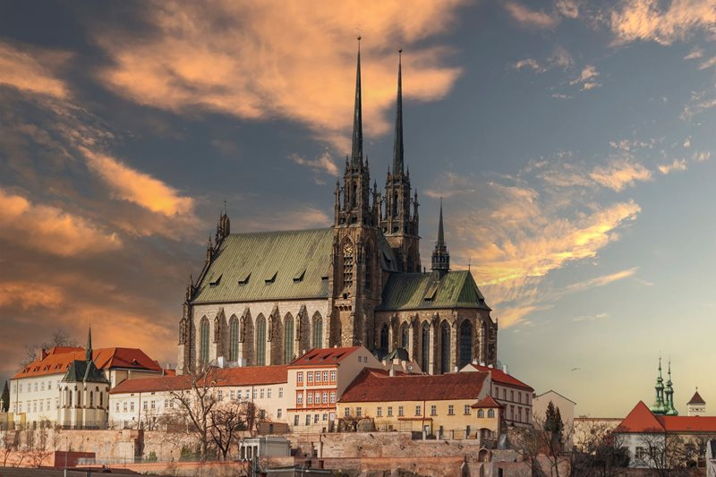
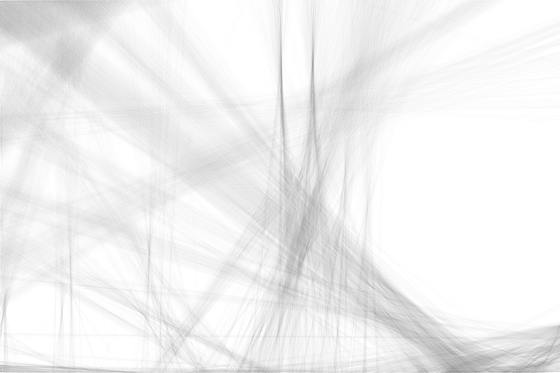
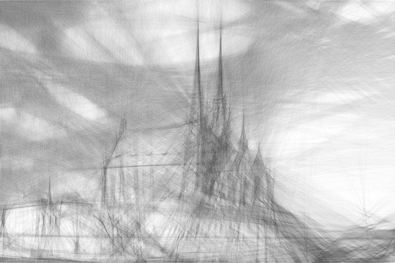
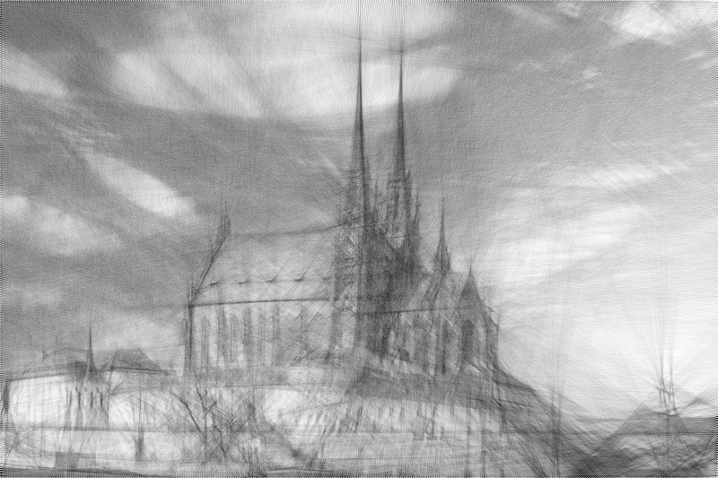
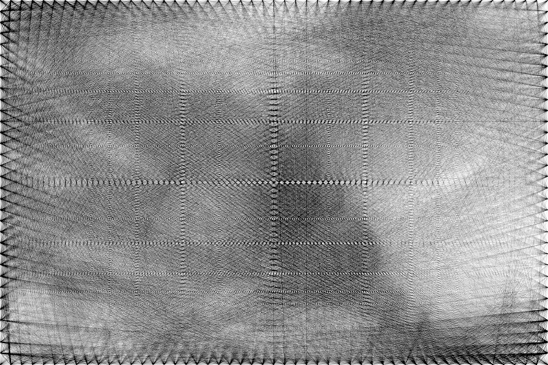
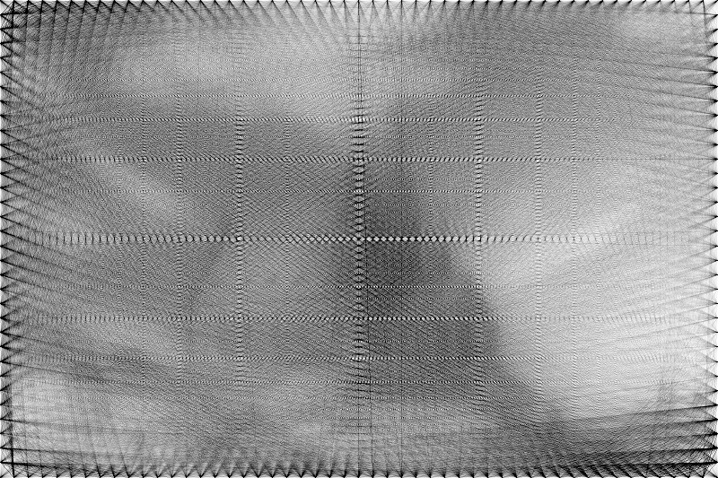

 # Vítejte v aplikaci "Image Reconstruction with Lines"

 ## O aplikaci

Skript slouží k vytváření obrazů pouze přímkami. Jedná se o rekonstrukci dle článku Roberta Reifa:
https://www.robertoreif.com/blog/2018/1/7/drawing-with-straight-lines

Skript obsahuje automatickou kontrolu hodnoty LSE, která ukončí běh programu při nalezení nejnižší chyby + je přidána možnost 
nastavení tloušťky kreslených přímek.

Výsledky skriptu potvrzují Reifovu analýzu. Nejnižší chyby dosahujeme snížením vzdálenosti mezi kolíky a zmenšením světlosti 
kreslené přímky. Na druhou stranu to však vede k výraznému nárůstu výpočetního času.

**Přehled zkratek:**
- **PBP** = pixelů mezi kolíky
- **GS** = světlost kreslené přímky
- **LSE** = velikost chyby
- **LN** = počet přímek
- **TH** = tloušťka přímky
- **ET** = doba výpočtu [s]

V tabulce níže je postupné formování obrázku s tím, jak narůstá počet přímek. 
**Počáteční podmínky:** 
- **PBP** = 2
- **GS** = 2
- **TH** = 0 (tloušťka přímky 1px)

<table>
  <tr>
    <td></td>
    <td></td>
    <td></td>
  </tr>
    <tr>
    <td align="center">originální obrázek</td>
    <td align="center">LSE-0.230_LN-8000</td>
    <td align="center">LSE-0.149_LN-18000</td>
  </tr>
  <tr>
    <td></td>
    <td></td>
    <td></td>
  </tr>
  <tr>
    <td align="center">LSE-0.086_LN-28000</td>
    <td align="center">LSE-0.042_LN-38000</td>
    <td align="center">LSE-0.023_TH-0_LN-44730</td>
  </tr>
</table>

V tabulce níže je ukázka vlivu PBP na velikost chyby. Obrázky níže mají konstantní GS, ale proměnou PBP.
**Počáteční podmínky:** 
- **PBP** = 16,12,8,4,2
- **GS** = 16
- **TH** = 0 (tloušťka přímky 1px)

<table>
  <tr>
    <td></td>
    <td></td>
    <td></td>
  </tr>
    <tr>
    <td align="center">originální obrázek</td>
    <td align="center">LSE-0.037_LN-5987</td>
    <td align="center">LSE-0.031_LN-6342</td>
  </tr>
  <tr>
    <td></td>
    <td></td>
    <td></td>
  </tr>
  <tr>
    <td align="center">LSE-0.030_LN-6518</td>
    <td align="center">LSE-0.027_LN-6829</td>
    <td align="center">LSE-0.030_LN-6112</td>
  </tr>
</table>

V tabulce níže je ukázka vlivu GS na velikost chyby. Obrázky níže mají konstantní PBP, ale proměnou GS.
**Počáteční podmínky:** 
- **PBP** = 16
- **GS** = 16,12,8,4,2
- **TH** = 0 (tloušťka přímky 1px)

<table>
  <tr>
    <td></td>
    <td></td>
    <td></td>
  </tr>
    <tr>
    <td align="center">originální obrázek</td>
    <td align="center">LSE-0.037_LN-5987</td>
    <td align="center">LSE-0.031_LN-6342</td>
  </tr>
  <tr>
    <td></td>
    <td></td>
    <td></td>
  </tr>
  <tr>
    <td align="center">LSE-0.030_LN-6518</td>
    <td align="center">LSE-0.027_LN-6829</td>
    <td align="center">LSE-0.030_LN-6112</td>
  </tr>
</table>
