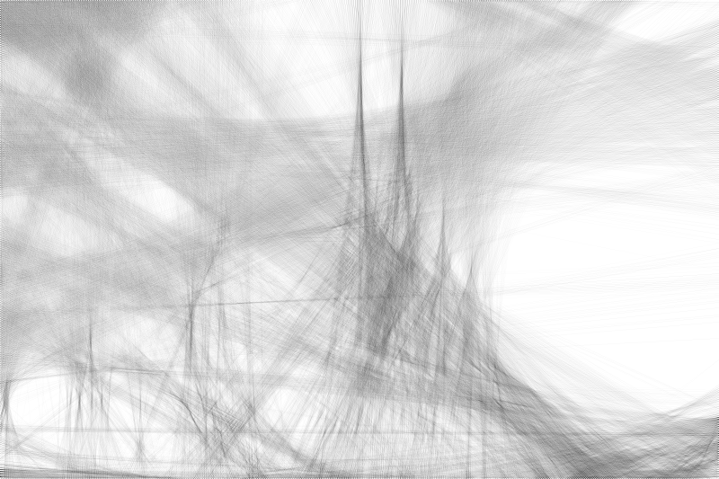

 # Vítejte v aplikaci "Image Reconstruction with Lines"

 ## O aplikaci

Skript slouží k vytváření obrazů pouze přímkami. Jedná se o rekonstrukci dle článku Roberta Reifa:
https://www.robertoreif.com/blog/2018/1/7/drawing-with-straight-lines

Skript obsahuje automatickou kontrolu hodnoty LSA, která ukončí běh při nalezení nejnižší chyby + je přidána možnost 
nastavení tloušťky kreslených přímek.

Výsledky skriptu potvrzují Reifovu analýzu. Nejnižší chyby dosahujeme snížením vzdálenosti mezi kolíky a zmenšením světlosti 
kreslené přímky. Na druhou stranu to však vede k výraznému nárůstu výpočetního času.

<table>
  <tr>
    <td></td>
    <td></td>
    <td></td>
  </tr>
    <tr>
    <td align="center">originální obrázek</td>
    <td align="center">LSE-0.230_LN-8000</td>
    <td align="center">LSE-0.149_LN-18000</td>
  </tr>
  <tr>
    <td></td>
    <td></td>
    <td></td>
  </tr>
  <tr>
    <td align="center">LSE-0.086_LN-28000</td>
    <td align="center">LSE-0.042_LN-38000</td>
    <td align="center">LSE-0.023_TH-0_LN-44730</td>
  </tr>
</table>

